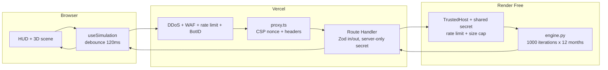

# Aura Workspace

Spatial Business Simulator by Fluxis Labs. A 3D command center where every slider change asks a Python Monte Carlo engine for a fresh 12-month SaaS projection, then redraws seven glowing nodes from those server-side results alone.

**Product:** Aura Workspace - Spatial Business Simulator  
**Agency:** [Fluxis Labs](https://github.com/Marko-Vuchko)  
**Repo:** [Marko-Vuchko/fluxis-labs-aura-workspace](https://github.com/Marko-Vuchko/fluxis-labs-aura-workspace)

## Architecture

The browser never talks to Render directly. Every call passes through Vercel so WAF, rate limits, BotID, and CSP apply, while the backend URL and shared secret stay server-only.



Three non-negotiable rules:

1. No business number is computed in the browser.
2. The backend returns insight codes, not sentences - the client localizes them.
3. All traffic goes through Vercel.

## Stack

| Layer | Tech |
| --- | --- |
| Frontend | Next.js 16 (App Router), React 19, Tailwind v4, shadcn/ui |
| 3D | three.js, React Three Fiber, Drei, postprocessing |
| Motion / i18n | motion, bilingual EN/SR dictionary |
| Validation | Zod on the Route Handler boundary |
| Backend | Python FastAPI + Uvicorn, NumPy, Pandas |
| Hosting | Vercel (frontend), Render Free (backend) |

## Monte Carlo model (plain language)

Each slider change runs **1000 iterations across 12 months**. Every iteration rolls realistic noise for lead cost, conversion, and churn, then walks the firm month by month under a fixed team capacity. Overload raises churn. The engine returns percentile bands, a risk score, node coordinates for the scene, sensitivity ranks, and three insight codes. If the link drops, the UI keeps the last Python result marked stale instead of inventing replacement math.

## Local development

### Prerequisites

- Node.js 24+
- Python 3.13+ (NumPy 2.5 requires Python >= 3.12)
- Backend venv created once:

```powershell
cd backend
python -m venv .venv
.\.venv\Scripts\Activate.ps1
pip install -r requirements-dev.txt
cd ..
```

Copy `.env.example` to `.env.local` and set `AURA_API_SECRET` to the same value the API will use.

### One command

From the repository root (Windows PowerShell):

```powershell
$env:AURA_API_SECRET = "dev-secret"
$env:AURA_ENV = "development"
npm run dev:all
```

This starts:

- Next.js on `http://localhost:3000` (prefix `next`, cyan)
- Uvicorn on `http://127.0.0.1:8000` (prefix `api`, magenta)

Case study page (no 3D, no three.js): `http://localhost:3000/about`

## Deploy

Owner-only runbooks (do not deploy from an agent session):

- [docs/DEPLOY.md](docs/DEPLOY.md) - Render service, Vercel env vars, WAF publish order
- [docs/WAF.md](docs/WAF.md) - staged WAF commands and Attack Challenge Mode
- [SECURITY.md](SECURITY.md) - private vulnerability reporting

1. **Backend (Render Free):** create the web service from `render.yaml` (Frankfurt, one Uvicorn worker). Python 3.13 is pinned in `backend/runtime.txt`. Set `AURA_API_SECRET`, `AURA_ENV=production`, and allowed hosts.
2. **Frontend (Vercel):** import the repo, set server-only `AURA_API_URL` and `AURA_API_SECRET` (no `NEXT_PUBLIC_` prefix). Optionally set `NEXT_PUBLIC_SITE_URL` for canonical metadata.
3. Publish WAF / BotID rules from the Vercel account owner after a staged rollout.

## Portfolio layer

- `/about` - static case study (architecture SVG, Monte Carlo explanation, challenges, GitHub link)
- Fluxis Labs URL lives in `lib/site-config.ts` as `FLUXIS_LABS_URL`. Leave it empty to hide the link; set one string when the site is live.
- Open Graph image is generated in code at `app/opengraph-image.tsx` (also used for the Twitter large card).

## Quality gates

```powershell
npx tsc --noEmit
npm run lint
npm run build
```

Backend (from `backend/` with venv active):

```powershell
ruff check .
pytest
```
