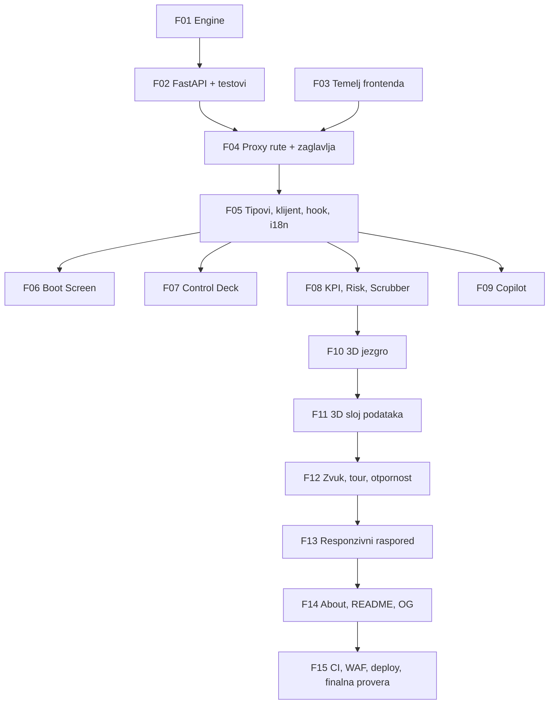

# PHASES / SoW - Aura Workspace

Podela projekta na **15 faza**, svaka veličine jednog agent chata. Svaka faza je zaokružena, verifikovana i commit-ovana pre nego što sledeća počne.

## Kako se koristi

1. Otvori **nov chat** za svaku fazu. Ne nastavljaj prethodni.
2. Kopiraj ceo prompt iz odgovarajuće sekcije i pošalji ga kao prvu poruku.
3. Kada agent javi da je faza gotova i da provere prolaze, pređi na sledeću fazu u novom chatu.
4. Ako agent kaže da je blokiran, ne teraj ga. Pročitaj njegov nalaz i odluči.

## Zašto ovakva podela

Svaka faza je namerno ograničena tako da agent otvori mali broj fajlova i napiše ograničenu količinu koda. Prompti eksplicitno zabranjuju čitanje celog repozitorijuma, jer je upravo to najčešći uzrok punjenja konteksta i sažimanja chata. Zajednički kontekst ne živi u razgovoru nego u [docs/PRD.md](PRD.md), koji svaka faza čita **selektivno**, samo one sekcije koje su joj potrebne.

## Redosled i zavisnosti



---

## FAZA 01 - Python Monte Carlo engine

**Cilj:** čista matematika bez FastAPI-ja, spremna za testiranje.

```text
Radis na projektu Aura Workspace u repozitorijumu C:\Users\Marko\Desktop\aura_workspace.

OBAVEZNO PROCITAJ PRE PISANJA KODA:
- docs/PRD.md, sekcije 5 (Domenski model) i 6 (Ugovor podataka). Samo te dve sekcije.

NE CITAJ ostatak repozitorijuma. Frontend te u ovoj fazi ne zanima.

ZADATAK:
Napisi backend/engine.py - cistu, vektorizovanu Monte Carlo simulaciju bez ijedne FastAPI zavisnosti.

1. Sve konstante iz PRD sekcije 5.1 stavi imenovane na vrh fajla, tacno tim imenima i vrednostima.
2. Implementiraj jezgro iz PRD 5.2 kao jedan vektorizovan NumPy prolaz oblika (ITERATIONS, MONTHS).
   Petlja po mesecima je dozvoljena SAMO za kumulativnu bazu klijenata. Petlja po iteracijama nije dozvoljena.
3. Izracunaj po mesecu: revenue/profit/margin kao p10/p50/p90, customers, churn_rate, capacity_used, cash,
   runway_months (None kada je firma profitabilna), i Risk Score razlozen na 4 komponente po PRD 5.3.
4. Izracunaj zdravlje 0-100 i koordinate [x, y, z] za svih 7 cvorova po mesecu, po pravilima iz PRD 5.5.
   PAZNJA, ovo su DVA razlicita redosleda i lako se pogrese:
   - redosled U NIZU odgovora je: marketing, sales, support, operations, profit, churn, cash_runway
   - UGAONI redosled u prstenu je drugaciji: Marketing 0, Sales 60, Support 120, Churn 180,
     Operations 240, Cash Runway 300 stepeni, a Profit je izdignut po osi Y iznad centra prstena
   Ugao izvedi iz IMENA cvora preko eksplicitne mape, nikada iz indeksa u nizu.
   Radijus od centra nosi zdravlje metrike.
5. Godisnji rezime, histogram ukupnog godisnjeg profita u 30 binova, i matricu osetljivosti po PRD 5.4
   (korelacija usumljenih ulaza unutar istog prolaza, BEZ dodatnih simulacija).
6. Katalog insight pravila iz PRD 6.4 - implementiraj sva 22 koda kao funkcije koje vracaju
   {code, severity, params} ili None. Vrati tri najozbiljnija.
7. Pandas koristi za agregaciju percentila i mesecnu tabelu. NumPy za simulaciju.
8. Napisi i backend/schemas.py sa dataclass ili TypedDict tipovima koje engine vraca.

OGRANICENJA:
- Bez FastAPI, bez HTTP-a, bez I/O. Ovo je cista funkcija.
- Pune type hint anotacije na svemu.
- Bez magicnih brojeva u telu funkcija; sve ide u konstante na vrhu.
- Nijedan tekst na engleskom ili srpskom ne sme biti u engine-u. Insight vraca SAMO kod i parametre.
- Nikada ne koristi em dash znak, samo obican crticu.
- Svi brojevi u izlazu zaokruzeni na dve decimale.

DEFINICIJA ZAVRSENOG:
Pokreni engine iz kratke skripte sa podrazumevanim vrednostima iz PRD 6.1 i ispisi rezultat.
Dokazi mi izlazom da: risk je izmedju 0 i 100, ima tacno 12 meseci, svaki mesec ima tacno 7 cvorova,
histogram ima 30 counts i 31 bin_edges, da dva poziva sa istim seed-om daju identican rezultat,
i da dva poziva sa RAZLICITIM seed-om daju razlicit rezultat koji i dalje pada unutar p10/p90 opsega.

Ne commit-uj. Javi mi rezultat i cekaj potvrdu.
```

---

## FAZA 02 - FastAPI sloj, bezbednost i testovi

**Cilj:** engine dobija HTTP fasadu sa punom zaštitom, plus pytest paket.

```text
Radis na projektu Aura Workspace u repozitorijumu C:\Users\Marko\Desktop\aura_workspace.
backend/engine.py i backend/schemas.py vec postoje i rade.

OBAVEZNO PROCITAJ:
- docs/PRD.md, sekcije 6 (Ugovor podataka) i 8.1 (Bezbednost).
- backend/engine.py i backend/schemas.py

NE CITAJ frontend fajlove.

ZADATAK:
1. backend/main.py - FastAPI aplikacija sa POST /api/simulate i GET /health po ugovoru iz PRD 6.2 i 6.3.
2. Pydantic v2 modeli sa Field(ge=..., le=...) tacno po opsezima iz PRD 6.1 i extra="forbid".
   Nepoznato polje ili vrednost van opsega vraca 422 sa opisom polja.
3. Odbij NaN i beskonacne vrednosti pre nego sto stignu do NumPy-ja.
4. Bezbednosni sloj, sve iz PRD 8.1 reda "FastAPI":
   - provera deljene tajne iz zaglavlja X-Aura-Key protiv env varijable AURA_API_SECRET;
     zahtev bez nje se odbija sa 401
   - TrustedHostMiddleware
   - rate limit 60 zahteva u minuti po IP, u memoriji, bez nove zavisnosti
   - globalno ogranicenje istovremenih zahteva
   - tvrd limit velicine tela zahteva, odbij sve preko 4 KB pre parsiranja
   - globalni exception handler koji vraca genericku poruku, nikad stack trace
   - /docs, /redoc i /openapi.json ugaseni kada je AURA_ENV=production
   - GZipMiddleware
   - strukturirano logovanje sa HESIRANIM IP-om, trajanjem simulacije i risk score-om
   - CORS zakljucan samo na localhost za lokalni razvoj
5. backend/requirements.txt i backend/requirements-dev.txt sa TACNIM pinovima (bez ~= i ^).
   Dev fajl nosi pytest i ruff. runtime.txt sa python-3.11.
6. backend/tests/ sa pytest testovima: determinizam sa fiksnim seed-om, 0 <= risk <= 100,
   margine u ocekivanom opsegu, odbijanje nepoznatih polja, odbijanje NaN,
   odbijanje zahteva bez tajne, i 422 za vrednosti van opsega.
7. backend/Readme.md sa uputstvom za pokretanje.

OGRANICENJA:
- Ne diraj engine.py osim ako nadjes stvarnu gresku; ako je nadjes, javi mi pre nego sto je popravis.
- Bez novih zavisnosti van fastapi, uvicorn[standard], numpy, pandas, pydantic.
- Nikada ne koristi em dash znak.
- Ne pokrecej nikakav deploy.

DEFINICIJA ZAVRSENOG:
Kreiraj venv, instaliraj oba requirements fajla, pokreni ruff check i pytest - oba moraju proci bez greske.
Pokreni uvicorn i stvarnim HTTP zahtevima dokazi: /health vraca telemetriju, /api/simulate sa validnom
tajnom vraca pun paket, bez tajne vraca 401, sa nepoznatim poljem vraca 422.
Prilozi izlaz kao dokaz.

Kada sve prodje, commit: "feat(backend): add FastAPI simulation service with hardened request handling"
```

---

## FAZA 03 - Temelj frontenda: čišćenje, shadcn, tema

**Cilj:** repo prestaje da liči na generisani starter i dobija vizuelni identitet.

```text
Radis na projektu Aura Workspace u repozitorijumu C:\Users\Marko\Desktop\aura_workspace.
Ovo je Next.js 16.3.0 sa React 19.2.8 i Tailwind v4.

OBAVEZNO PROCITAJ:
- docs/PRD.md, sekcije 9 (Struktura repozitorijuma) i 10 (Vizuelni identitet).
- node_modules/next/dist/docs/01-app/02-guides/single-page-applications.md
- app/layout.tsx, app/globals.css, next.config.ts

NE CITAJ backend/ niti bilo sta drugo.

VAZNO: Ovo NIJE Next.js koji poznajes. Pre pisanja bilo kog Next koda procitaj relevantan dokument
iz node_modules/next/dist/docs/. U Next 16 middleware.ts vise ne postoji, zamenjen je fajlom proxy.ts.

ZADATAK, tacno ovim redosledom:
1. Obrisi sav create-next-app boilerplate: demo sadrzaj u app/page.tsx, public/next.svg, public/vercel.svg,
   podrazumevani README.md i metadata "Create Next App". Ostavi AGENTS.md i CLAUDE.md na miru, njih Next
   sam regenerise.
2. TEK POSLE toga pokreni tacno ovu komandu, jer ona prepisuje app/globals.css:
   npx shadcn@latest init --preset b27GcrRo --template next --pointer
   Preset donosi Inter font i neutral temu. To je ocekivano i prepisujemo ga u sledecem koraku.
   Ako komanda pukne, NE improvizuj - javi mi tacnu gresku i cekaj.
3. Prepisi temu u app/globals.css kroz Tailwind v4 @theme na Deep Space Cyan paletu iz PRD 10.
   Vrati Geist Sans i Geist Mono u app/layout.tsx umesto Inter-a.
4. Instaliraj 3D lanac sa TACNIM verzijama bez caret znaka:
   three@0.185.1, @react-three/fiber@9.7.0, @react-three/drei@10.7.8,
   @react-three/postprocessing@3.0.5, postprocessing
   Ostale sa caret-om: motion, zod, botid
5. Dodaj shadcn komponente koje ce trebati: slider, button, card, badge, tooltip, separator.
6. Kreiraj prazne foldere sa .gitkeep po strukturi iz PRD 9: features/simulation, features/scene,
   features/hud, features/copilot, features/boot, features/tour, lib/i18n, lib/audio.
7. next.config.ts: poweredByHeader: false.
8. app/page.tsx neka za sada bude minimalan ekran sa naslovom Aura Workspace na novoj temi.
9. GIT REMOTE. Lokalni repo ima jedan commit i NEMA remote, a Marko-Vuchko/fluxis-labs-aura-workspace
   je javan i potpuno prazan. Uradi tacno ovo, ovim redosledom:
   - proveri git remote -v i potvrdi mi da je prazno pre nego sto bilo sta dodas
   - git remote add origin https://github.com/Marko-Vuchko/fluxis-labs-aura-workspace.git
   - proveri .gitignore: .env, .env.local, .next, venv, __pycache__, node_modules
   - commit-uj rad iz ove faze i push-uj granu main sa -u
   - potvrdi mi izlazom da je push prosao

OGRANICENJA:
- NE dirati React verziju. R3F trazi react >=19 <19.3, a imamo 19.2.8.
- Ne pisi nikakvu poslovnu logiku u ovoj fazi.
- Repozitorijum je JAVAN. Pre push-a proveri da nijedna tajna, .env fajl ni kljuc nisu u staged
  fajlovima. Ako nadjes bilo sta sumnjivo, STANI i javi mi umesto da push-ujes.
- NIKADA force push. NIKADA ne menjaj vidljivost repozitorijuma. NIKADA ne diraj git config.
- Nikada ne koristi em dash znak.
- TypeScript strict, bez ijednog any.

DEFINICIJA ZAVRSENOG:
npx tsc --noEmit, npx eslint . i npm run build prolaze bez greske.
Pokreni npm run dev i posalji mi screenshot pocetne stranice na novoj tamnoj temi.
git status je cist i git log na remote-u pokazuje tvoj commit.

Commit: "chore(frontend): replace starter scaffold with Aura design system foundation"

NAPOMENA ZA SVE NAREDNE FAZE: remote je od sada povezan, pa svaka sledeca faza posle commit-a
radi i git push. Backend iz faza 01 i 02 je commit-ovan pre nego sto je remote postojao, pa ce
prvi push u ovoj fazi objaviti i njega.
```

---

## FAZA 04 - Bezbednosna ljuska: proxy.ts i API rute

**Cilj:** jedina kapija ka Renderu, plus pun set zaglavlja.

```text
Radis na projektu Aura Workspace u repozitorijumu C:\Users\Marko\Desktop\aura_workspace.
Backend je gotov i radi lokalno na http://127.0.0.1:8000. Frontend temelj je postavljen.

OBAVEZNO PROCITAJ:
- docs/PRD.md, sekcije 4 (Arhitektura), 6 (Ugovor podataka) i 8.1 (Bezbednost).
- node_modules/next/dist/docs/01-app/02-guides/content-security-policy.md
- backend/main.py samo da potvrdis imena polja i zaglavlja

NE CITAJ features/ ni backend/engine.py.

KLJUCNA ARHITEKTONSKA CINJENICA:
Browser NIKADA ne zove Render direktno. Sve ide kroz Vercel Route Handler. Adresa i tajna zive u
server-only varijablama AURA_API_URL i AURA_API_SECRET, BEZ NEXT_PUBLIC_ prefiksa.

ZADATAK:
1. proxy.ts u rootu (ne middleware.ts, u Next 16 to vise ne postoji):
   - CSP sa nonce i strict-dynamic, 'unsafe-eval' SAMO kada je NODE_ENV development
   - connect-src 'self' jer vise nema poziva na strani domen
   - HSTS sa preload, X-Content-Type-Options nosniff, frame-ancestors 'none',
     Referrer-Policy strict-origin-when-cross-origin, Permissions-Policy koji gasi kameru, mikrofon,
     geolokaciju, USB i placanja, Cross-Origin-Opener-Policy same-origin,
     Cross-Origin-Resource-Policy same-origin, upgrade-insecure-requests
   - matcher koji preskace _next/static, _next/image i favicon
2. app/api/health/route.ts - prosledjuje GET na ${AURA_API_URL}/health sa X-Aura-Key zaglavljem.
3. app/api/simulate/route.ts:
   - Zod sema ulaza koja preslikava opsege iz PRD 6.1; nevalidan ulaz vraca 400 pre ikakvog mreznog poziva
   - Zod sema izlaza koja validira odgovor Rendera PRE nego sto ga vrati klijentu
   - provera Origin i Sec-Fetch-Site; odbij sve sto nije same-origin
   - BotID provera na basic nivou
   - AbortController timeout 15 sekundi
   - cap na velicinu tela zahteva
   - nikada ne prosledjuj poruku greske sa Rendera doslovno; vrati genericku i loguj detalj na serveru
4. next.config.ts: umotaj konfiguraciju u withBotId iz botid/next/config.
5. instrumentation-client.ts sa initBotId koji stiti path /api/simulate metodom POST.
6. .env.example sa AURA_API_URL i AURA_API_SECRET i komentarom da NEMAJU NEXT_PUBLIC_ prefiks.
   .env.local dodaj u .gitignore ako vec nije.
7. lib/env.ts koji cita i validira server-only varijable kroz Zod, sa fallback-om
   na http://127.0.0.1:8000 kada je NODE_ENV development.

OGRANICENJA:
- Nijedna tajna ne sme zavrsiti u klijentskom bundle-u. Ako se zapitas da li je nesto server-only, jeste.
- Ne pisi UI u ovoj fazi.
- Nikada ne koristi em dash znak.
- TypeScript strict, bez any.

DEFINICIJA ZAVRSENOG:
Pokreni backend i frontend. Sa curl-om dokazi:
- GET /api/health vraca telemetriju
- POST /api/simulate bez Origin zaglavlja biva odbijen
- POST /api/simulate sa vrednoscu van opsega vraca 400 i NE pogadja Render
- u odgovoru stvarno stizu CSP, HSTS i ostala zaglavlja
Prilozi izlaz kao dokaz. tsc, eslint i build moraju proci.

Commit: "feat(security): route all backend traffic through hardened Vercel proxy layer"
```

---

## FAZA 05 - Tipovi, API klijent, hook i i18n

**Cilj:** jedini izvor istine za stanje aplikacije i ceo prevodilački sloj.

```text
Radis na projektu Aura Workspace u repozitorijumu C:\Users\Marko\Desktop\aura_workspace.
Bezbedne API rute na /api/simulate i /api/health vec rade.

OBAVEZNO PROCITAJ:
- docs/PRD.md, sekcije 6 (Ugovor podataka), 6.4 (Katalog insight kodova) i FR-7 iz sekcije 7.
- node_modules/next/dist/docs/01-app/02-guides/internationalization.md
- app/api/simulate/route.ts

NE CITAJ backend/ ni features/scene.

ZADATAK:
1. features/simulation/types.ts - rucno ogledalo Pydantic seme iz PRD 6.2 i 6.3. Bez ijednog any.
   Mesecni snimak, stanje cvora, histogram, osetljivost, insight - sve tipizovano.
2. features/simulation/api-client.ts:
   - poziva same-origin /api/simulate i /api/health
   - AbortController, timeout, eksponencijalni backoff za cold start
   - vraca diskriminisanu uniju { ok: true; data } | { ok: false; error } tako da neuhvacena
     greska ne moze da procuri
3. features/simulation/defaults.ts - podrazumevane vrednosti iz PRD 6.1.
4. features/simulation/presets.ts - cetiri preseta: Bootstrap, Growth Push, Overload Crisis, Optimized.
   Vrednosti postavi po svom najboljem sudu, kalibrisacemo ih u kasnijoj fazi.
5. features/simulation/use-simulation.ts - jedini izvor istine:
   - drzi pet parametara, izabrani mesec scrubber-a, poslednji rezultat i status
   - status masina: booting | ready | simulating | stale | error
   - debounce 120 ms tokom prevlacenja PLUS obavezan finalni zahtev na otpustanje
   - otkazuje prethodni zahtev preko AbortController-a
   - pri gresci prelazi u stale i zadrzava poslednji rezultat, nikad ne racuna zamenu
6. lib/i18n/dictionary.ts - as const recnik sa en i sr kljucevima. Mora pokriti:
   sve UI labele, boot poruke, svih 22 insight koda iz PRD 6.4 sa interpolacijom parametara,
   guided tour i tekst za /about.
7. lib/i18n/language-provider.tsx - React Context, engleski je podrazumevan, izbor se pamti u
   localStorage, promena je trenutna bez reload-a. Tipizovan t() koji na nepostojeci kljuc
   pada u compile-time.
8. lib/i18n/format.ts - kompaktan format brojeva (284.3k) i puna vrednost za tooltip.
   ENGLESKI format u OBA jezika.

OGRANICENJA:
- Nijedna matematicka operacija nad poslovnim podacima na klijentu. Formatiranje broja je dozvoljeno,
  racunanje profita, rizika ili margine nije.
- Interpolacija u recniku ide ISKLJUCIVO kao tekst, nikada kao HTML. Bez dangerouslySetInnerHTML.
- Nikada ne koristi em dash znak, ni u engleskom ni u srpskom tekstu.
- TypeScript strict, bez any.

DEFINICIJA ZAVRSENOG:
Napravi privremenu test stranicu koja poziva hook i ispisuje sirove brojke kao tekst.
Dokazi mi da prevlacenje vrednosti okida zahtev, da rezultat stize, i da promena jezika menja labele.
tsc, eslint i build prolaze.

Commit: "feat(simulation): add typed API client, simulation state machine and bilingual dictionary"
```

---

## FAZA 06 - Boot Screen

**Cilj:** cold start pretvoren u dramaturgiju koja ne laže.

```text
Radis na projektu Aura Workspace u repozitorijumu C:\Users\Marko\Desktop\aura_workspace.
Hook useSimulation i i18n vec rade.

OBAVEZNO PROCITAJ:
- docs/PRD.md, FR-1 iz sekcije 7, i sekciju 10 (Vizuelni identitet).
- features/simulation/api-client.ts i features/simulation/use-simulation.ts
- lib/i18n/dictionary.ts

NE CITAJ backend/ ni features/scene.

ZADATAK:
1. features/boot/boot-screen.tsx:
   - naslov tacno "Booting Aura Engine & Synchronizing Python Neural Nodes..."
   - wake ping ka /api/health krece cim se komponenta montira
   - poll do 90 sekundi, pa ponuda Retry
   - traka napretka vezana za STVARNI tok, ne za tajmer
   - dugme ENTER AURA na kraju
2. features/boot/boot-log.ts - ispisuje SAMO stvarne dogadjaje:
   redni broj pokusaja konekcije, izmereno vreme odgovora u ms, verzija engine-a i
   numpy_warmup_ms iz /health odgovora, pa potvrda da je prva simulacija stigla.
   NIJEDNA rezirana sci-fi linija. Ako podatak ne postoji, linija se ne ispisuje.
3. Prva simulacija se salje jos TOKOM boot-a, tako da je rezultat spreman pre nego sto
   korisnik pritisne ENTER AURA.
4. ENTER AURA kreira i otkljucava AudioContext (samo kreiranje, zvuk dolazi u kasnijoj fazi)
   i podize zastavicu u stanju da je korisnik usao.
5. Animacije preko motion. Postuj prefers-reduced-motion.
6. Poveži u app/page.tsx tako da se Boot Screen prikazuje dok status nije ready.

OGRANICENJA:
- Nijedan izmisljen podatak na ekranu. Traka napretka sme da interpolira izmedju stvarnih dogadjaja,
  ali brojke moraju biti merene.
- Ne pisi 3D kod.
- Nikada ne koristi em dash znak.
- TypeScript strict, bez any.

DEFINICIJA ZAVRSENOG:
Ugasi backend, ucitaj stranicu i pokazi mi da Boot Screen strpljivo pokusava i posle 90 s nudi Retry.
Upali backend i pokazi da prolazi kroz stvarnu telemetriju do ENTER AURA dugmeta.
Prilozi oba screenshot-a. tsc, eslint i build prolaze.

Commit: "feat(boot): add cold-start boot sequence driven by real engine telemetry"
```

---

## FAZA 07 - Control Deck i presetovi

**Cilj:** pet slajdera i četiri režirana scenarija.

```text
Radis na projektu Aura Workspace u repozitorijumu C:\Users\Marko\Desktop\aura_workspace.
Hook, i18n i Boot Screen rade. Backend radi lokalno.

OBAVEZNO PROCITAJ:
- docs/PRD.md, sekcije 6.1 (Opsezi ulaza), FR-2 i FR-2b iz sekcije 7, i sekciju 10.
- features/simulation/use-simulation.ts, defaults.ts, presets.ts
- lib/i18n/dictionary.ts

NE CITAJ backend/ ni features/scene.

ZADATAK:
1. features/hud/control-deck.tsx - pet slajdera po PRD 6.1: Ad Spend, Price, Team Size,
   Operating Costs, Cash Reserve. Svaki ima:
   - shadcn Slider prestilizovan u svetlecu sinu u Deep Space Cyan paleti
   - zivu brojku iznad
   - malo polje za precizan unos vrednosti, sa validacijom na opseg
   - punu tastaturnu kontrolu i aria labelu
2. features/hud/preset-bar.tsx - cetiri preseta. Klik animirano prevlaci slajdere kroz 600 ms
   preko motion, ali salje TACNO JEDAN zahtev na kraju animacije.
3. KALIBRACIJA PRESETA je deo zadatka. Pozovi backend stvarnim zahtevima i podesi vrednosti tako da:
   - Bootstrap: profitabilan ali zut, skroman obim
   - Growth Push: visok prihod uz narandzast Support cvor
   - Overload Crisis: vise crvenih cvorova, tim ociglednо preopterecen
   - Optimized: skoro sve zeleno
   Zapisi u backend/tests/ pytest test koji zakljucava da svaki preset i dalje pogadja svoje ciljno stanje.
4. Prikazi negde diskretno konstante koje korisnik ne kontrolise, a uticu na rezultat:
   12 klijenata po coveku i 2500 USD po glavi mesecno. Uzmi ih iz meta odgovora ako ih backend salje,
   inace iz lokalne konstante koja se poklapa sa PRD 5.1. Bez ovoga slajder za tim deluje kao da
   nema cenu, a preopterecenje kao da je proizvoljno.
5. features/hud/reseed-control.tsx po PRD FR-2b - diskretno RESEED dugme, namerno nenametljivo
   i van glavnog toka paznje:
   - klik generise nov ceo broj kao seed, upisuje ga u stanje hook-a i salje jednu simulaciju
   - trenutni seed se ispisuje pored dugmeta u Geist Mono fontu
   - povratak na FIXED_SEED mora biti moguc jednim klikom, da se demo uvek vrati u poznato stanje
   - u recnik dodaj EN i SR tekst i kratak tooltip koji objasnjava CEMU dugme sluzi:
     dokazuje da je rec o stvarnoj stohastickoj simulaciji, a ne o unapred izracunatoj tabeli
   Prosiri i features/simulation/use-simulation.ts da nosi opcioni seed u zahtevu.

OGRANICENJA:
- Nijedna poslovna matematika na klijentu. Nov seed je nasumican ceo broj, ne izvedena vrednost.
- RESEED ne sme biti vizuelno ravnopravan sa presetima. Presetovi su glavni tok, RESEED je fusnota.
- Zvuk NE implementiraj u ovoj fazi, dolazi kasnije. Ostavi prazan hook poziv na mestu gde ce ici.
- Nikada ne koristi em dash znak.
- TypeScript strict, bez any.

DEFINICIJA ZAVRSENOG:
Pokazi mi screenshot Control Deck-a i dokaz iz Network taba da preset salje tacno jedan zahtev.
Klikni RESEED i dokazi mi da se brojke promene, ali ostanu unutar p10/p90 opsega prethodnog rezultata,
pa se povratkom na fiksni seed vrate na identicnu vrednost.
Pytest za presete prolazi. tsc, eslint i build prolaze.

Commit: "feat(hud): add control deck with five inputs, calibrated presets and reseed control"
```

---

## FAZA 08 - KPI panel, Risk gauge, scrubber i prekidači

**Cilj:** brojčani deo HUD-a i vremenska koherentnost celog ekrana.

```text
Radis na projektu Aura Workspace u repozitorijumu C:\Users\Marko\Desktop\aura_workspace.
Control Deck radi i salje zahteve.

OBAVEZNO PROCITAJ:
- docs/PRD.md, sekcije 5.3 (Risk Score), 6.2 (odgovor), FR-5, FR-9 i FR-9b iz sekcije 7, i sekciju 10.
- features/simulation/use-simulation.ts i types.ts
- lib/i18n/format.ts

NE CITAJ backend/ ni features/scene.

ZADATAK:
1. features/hud/kpi-panel.tsx - prihod, profit, marza i zavrsni kes za IZABRANI mesec.
   Prikazuje se p50. Kompaktan format (284.3k), a puna vrednost (284,312 USD) SAMO na hover
   u tooltip-u. Marze na jednu decimalu, runway na jednu decimalu meseci.
   p10 i p90 NE stoje trajno pored brojke jer bi panel postao pretrpan; oni idu u isti hover
   tooltip, ispod pune vrednosti.
2. features/hud/risk-gauge.tsx - Risk Score kao veliki broj sa bojom po pragovima,
   razlozen na cetiri mini bara: verovatnoca gubitka, preopterecenje tima, volatilnost profita,
   zavisnost od reklame. Nazivi iz recnika.
3. features/hud/month-scrubber.tsx - klizac po 12 meseci. STARTUJE NA MESECU 12.
   Pomeranje menja izabrani mesec u hook-u.
   VAZNO: ceo ekran prati scrubber. KPI, Risk i kasnije Copilot i 3D graf citaju izabrani mesec.
   Histogram je jedini izuzetak i uvek je godisnji, sto ce biti implementirano kasnije.
4. features/hud/status-badge.tsx - COMPUTING bedz i tanka linija napretka na vrhu tokom racunanja,
   LINK LOST bedz i oznaka zastarelih podataka kada je status stale.
   Scena i kontrole ostaju interaktivni u oba slucaja.
4b. features/hud/compute-badge.tsx po PRD FR-9b - stalna telemetrija pored statusnog bedza:
   vrednost compute_ms iz poslednjeg odgovora, plus broj iteracija i broj meseci iz meta bloka,
   sve u Geist Mono fontu.
   Ovo nije ukras. Broj iteracija je fiksan i nije izlozen korisniku, pa je izmereno vreme
   racunanja jedini vidljiv dokaz da Python zaista radi posao na svaki pomeraj slajdera.
   Vrednost UVEK dolazi iz meta.compute_ms u odgovoru. Nikada ne meri vreme na klijentu.
5. features/hud/language-switch.tsx i features/hud/sound-toggle.tsx - gore desno,
   segmentni prekidac EN/SR i ikonica zvucnika. Oba pamte izbor u localStorage.
   Sound toggle za sada samo cuva stanje, zvuk dolazi kasnije.
6. Sastavi sve u app/page.tsx po rasporedu iz PRD 10: Control Deck levo, KPI i Risk gore desno,
   scrubber dole na sredini. Prostor za scenu i Copilot ostavi prazan, dolaze u sledecim fazama.
7. Animirano prebrojavanje brojki (count-up) pri svakoj novoj simulaciji, preko motion.

OGRANICENJA:
- Nijedna poslovna matematika na klijentu. Ako ti neka vrednost fali u odgovoru, NE racunaj je -
  javi mi da nedostaje u ugovoru.
- Nikada ne koristi em dash znak.
- TypeScript strict, bez any.

DEFINICIJA ZAVRSENOG:
Screenshot HUD-a. Pomeri scrubber i dokazi da se KPI i Risk menjaju sa mesecom.
Dokazi da se compute_ms bedz menja sa svakim novim odgovorom i da se poklapa sa vrednoscu
koju vidis u Network tabu.
Ugasi backend i pokazi LINK LOST sa zadrzanim poslednjim podacima.
tsc, eslint i build prolaze.

Commit: "feat(hud): add KPI panel, decomposed risk gauge, month scrubber and compute telemetry"
```

---

## FAZA 09 - AI Strategic Copilot

**Cilj:** brojevi iz Pythona pretvoreni u rečenice, na oba jezika.

```text
Radis na projektu Aura Workspace u repozitorijumu C:\Users\Marko\Desktop\aura_workspace.
HUD sa KPI, Risk i scrubber-om radi.

OBAVEZNO PROCITAJ:
- docs/PRD.md, sekcije 5.4 (Osetljivost), 6.4 (Katalog insight kodova) i FR-6 iz sekcije 7.
- lib/i18n/dictionary.ts
- features/simulation/types.ts

NE CITAJ backend/ ni features/scene.

ZADATAK:
1. features/copilot/ai-copilot.tsx - panel na dnu ekrana. Prikazuje TRI najozbiljnija uvida
   za IZABRANI mesec, sortirano po ozbiljnosti, sa ikonicom nivoa (info, warning, critical).
   Pri svakoj novoj simulaciji uvidi se ZAMENJUJU uz stagger animaciju. Bez istorije.
2. features/copilot/insight-renderer.tsx - prima { code, severity, params } i renderuje
   lokalizovan tekst iz recnika. Nepoznat kod ne sme da srusi UI; prikazi diskretan fallback
   i loguj upozorenje u konzolu.
3. Dopuni lib/i18n/dictionary.ts punim EN i SR tekstovima za svih 22 koda iz PRD 6.4.
   Ton je precizan poslovni analiticar u punim recenicama sa konkretnim brojkama.
   Primer tona: "Team capacity exceeded by 34 percent. Projected churn rises to 8.2 percent
   within 3 months."
4. Kodovi REC_TOP_LEVER i REC_SECOND_LEVER koriste matricu osetljivosti. Formulisi ih tako da
   tvrde SMER i SNAGU poluge, nikada tacan procenat. Metod je korelacioni i ne pronalazi optimum,
   pa tekst ne sme obecati preciznost koju nema.
   Dobro: "Price is currently the strongest lever on profit."
   Lose: "Raise price by exactly 12 percent."
5. Kada je status stale, Copilot prikazuje poruku da je veza prekinuta i da su brojke poslednje poznate.

OGRANICENJA:
- Interpolacija parametara ide ISKLJUCIVO kao tekst. Bez dangerouslySetInnerHTML, bez HTML-a u recniku.
- Copilot ne sme sam da izvodi nikakav zakljucak iz brojki. On samo prevodi kodove koje je poslao Python.
- Nikada ne koristi em dash znak, ni u engleskom ni u srpskom tekstu.
- TypeScript strict, bez any.

DEFINICIJA ZAVRSENOG:
Pomeri slajdere u krizni scenario i pokazi mi screenshot Copilot-a na engleskom, pa isti na srpskom.
Brojke moraju biti identicne u oba jezika. tsc, eslint i build prolaze.

Commit: "feat(copilot): render localized strategic insights from engine-issued codes"
```

---

## FAZA 10 - 3D jezgro scene

**Cilj:** sedam čvorova, devet niti, čestice i upravljanje kvalitetom.

```text
Radis na projektu Aura Workspace u repozitorijumu C:\Users\Marko\Desktop\aura_workspace.
Ceo HUD i Copilot rade na pravim podacima. Ovo je najzahtevnija faza; drzi se opsega.

OBAVEZNO PROCITAJ:
- docs/PRD.md, sekcije 5.5 (Sedam cvorova), FR-3 iz sekcije 7, 8.2 (Performanse) i 10.
- node_modules/next/dist/docs/01-app/02-guides/lazy-loading.md
- features/simulation/types.ts i use-simulation.ts

NE CITAJ backend/ ni features/copilot.

ZADATAK:
1. features/scene/spatial-canvas.tsx - ucitan kroz dynamic(..., { ssr: false }).
   R3F Canvas, ograniceni OrbitControls sa spora auto-rotacijom koja PRESTAJE cim korisnik uhvati misa,
   pocetni kadar pod uglom od 20 stepeni.
2. features/scene/node-mesh.tsx - jedan cvor: ikosaedarski zicani ram koji sporo rotira,
   svetlece jezgro unutra, mek halo sprite. Boja po zdravlju (>70 zeleno #34D399,
   40-70 narandzasto #FBBF24, <40 crveno #FB7185). Puls ubrzava sa rizikom.
   Lerp 400 ms ka koordinatama koje je poslao Python, sa easing-om koji usporava na kraju.
   Hover daje HUD tooltip sa metrikama.
3. features/scene/link-flow.tsx - devet semantickih niti tacno po listi iz PRD 5.5.
4. features/scene/particle-field.tsx - SVE cestice u JEDNOM instanciranom mesh-u, jedan draw poziv.
   Pozicije se racunaju u useFrame po krivoj niti. Brzina proporcionalna protoku.
5. features/scene/scene-background.tsx - suptilna perspektivna mreza na podu koja bledi u daljinu,
   blaga magla, retke zvezdane tacke. Nista sto odvlaci paznju sa cvorova.
6. EffectComposer sa Bloom: prag 0.85, intenzitet 1.2. Tekst i brojke moraju ostati ostri.
7. features/scene/quality-manager.tsx - drei PerformanceMonitor sa TROSLOJNOM degradacijom:
   prvo pada dpr, pa broj cestica, pa TEK NA KRAJU bloom. Vizuelni identitet se cuva do poslednjeg trenutka.
8. Scena cita stanja cvorova za IZABRANI mesec iz scrubber-a i postavi je kao podlogu preko celog
   ekrana, ispod postojeceg HUD-a.
9. Postuj prefers-reduced-motion: gasi auto-rotaciju, cestice i pulsiranje.

OGRANICENJA:
- Histogram, projekcionu krivu i karticu detalja cvora NE radi u ovoj fazi. To je faza 11.
- Ne dodaji nove zavisnosti van vec instaliranog 3D lanca.
- Nikada ne koristi em dash znak.
- TypeScript strict, bez any. Za R3F tipove koristi zvanicne tipove, ne any.

DEFINICIJA ZAVRSENOG:
Screenshot scene u zdravom scenariju i u kriznom, gde se jasno vidi promena boja i pomeranje cvorova.
Izmeri FPS i javi mi ga. Pomeri scrubber i dokazi da se graf premotava kroz mesece.
tsc, eslint i build prolaze.

Commit: "feat(scene): add spatial node graph with semantic links and adaptive quality"
```

---

## FAZA 11 - Sloj podataka u 3D prostoru

**Cilj:** histogram, projekciona kriva i interakcija sa čvorom.

```text
Radis na projektu Aura Workspace u repozitorijumu C:\Users\Marko\Desktop\aura_workspace.
3D jezgro sa sedam cvorova i devet niti radi.

OBAVEZNO PROCITAJ:
- docs/PRD.md, FR-3, FR-4 i FR-5 iz sekcije 7, i sekciju 6.2 (histogram i months).
- features/scene/spatial-canvas.tsx i node-mesh.tsx
- features/hud/month-scrubber.tsx

NE CITAJ backend/ ni features/copilot.

ZADATAK:
1. features/scene/histogram-bars.tsx - 30 svetlecih stubova na PODU scene ispod grafa, sa refleksijom,
   kao holografska projekcija na stolu.
   VAZNO: histogram je UVEK godisnji (raspodela ukupnog godisnjeg profita) i NE menja se sa scrubber-om.
   Obavezno ga vidljivo oznaci kao godisnji, da ne bi delovao nedosledno sa ostatkom ekrana.
2. features/scene/projection-curve.tsx - svetleca kriva dvanaestomesecne projekcije koja lebdi u prostoru.
   Povezana je sa postojecim month-scrubber-om iz HUD-a; marker na krivoj prati izabrani mesec.
3. features/hud/node-detail-card.tsx - klik na cvor zakljucava cvor i otvara HTML karticu
   zakacenu za taj cvor u 3D prostoru preko drei Html. Kartica prati cvor dok se scena rotira.
   Kartica OSTAJE otvorena tokom premotavanja scrubber-a i njene brojke se ZIVO menjaju sa mesecom.
   Ponovni klik ili klik u prazno je zatvara.
4. Uskladi z-indeks i citljivost: kartica ne sme da nestane iza bloom-a niti da zakloni Control Deck.
5. Ukljuci histogram i krivu u troslojnu degradaciju iz quality-manager-a.

OGRANICENJA:
- Ne menjaj ponasanje scrubber-a, on je vec implementiran. Samo se prikaci na njega.
- Ne racunaj nista na klijentu. Histogram binove i tacke krive salje Python.
- Nikada ne koristi em dash znak.
- TypeScript strict, bez any.

DEFINICIJA ZAVRSENOG:
Screenshot scene sa histogramom i krivom. Klikni cvor, premotaj scrubber i pokazi da se brojke
u kartici menjaju dok histogram ostaje isti. Izmeri FPS posle dodavanja ovih slojeva i javi mi ga.
tsc, eslint i build prolaze.

Commit: "feat(scene): add annual profit histogram, projection curve and node detail card"
```

---

## FAZA 12 - Zvuk, guided tour i otpornost

**Cilj:** poslednji sloj doživljaja i garancija da klijent nikad ne vidi beli ekran.

```text
Radis na projektu Aura Workspace u repozitorijumu C:\Users\Marko\Desktop\aura_workspace.
Cela aplikacija radi vizuelno. Nedostaju zvuk, tour i zastita od pada.

OBAVEZNO PROCITAJ:
- docs/PRD.md, FR-8, FR-10 i FR-11 iz sekcije 7, i sekciju 8.3.
- features/boot/boot-screen.tsx (tamo se AudioContext otkljucava)
- features/hud/control-deck.tsx i sound-toggle.tsx

NE CITAJ backend/.

ZADATAK:
1. lib/audio/soundscape.ts - iskljucivo Web Audio API, BEZ ijednog audio fajla:
   - lazy AudioContext, OscillatorNode i GainNode sa mekim envelope-om
   - tonovi iz PENTATONSKE lestvice tako da nijedna kombinacija ne zvuci disonantno
   - visina tona prati vrednost slajdera
   - throttle da brzo prevlacenje ne napravi kakofoniju
   - poseban ton kada cvor predje u upozorenje ili u kriticno stanje
   - boot sekvenca sa narastajucim tonom i power up udarac na ENTER AURA
   - postuje izbor iz sound-toggle-a i localStorage
2. Poveži zvuk na mesta gde su u ranijim fazama ostavljeni prazni hook pozivi.
3. features/tour/guided-tour.tsx - cetiri koraka: scena, Control Deck, Copilot, presetovi.
   Istice element, preskociv je, pamti se u localStorage da se ne ponavlja.
   Pokrece se TEK posle ENTER AURA i TEK posto je prva simulacija vec popunila scenu.
4. Otpornost:
   - detekcija WebGL-a PRE montiranja scene; ako ga nema, elegantan zamenski 2D panel koji
     zadrzava SVE brojke iz Pythona
   - oporavak na onContextLost sa ponovnim pokusajem
   - granularni Error Boundary oko 3D scene i oko SVAKOG panela, sa futuristicki dizajniranim
     fallback-om, tako da pad jednog dela ne obara ceo ekran
5. prefers-reduced-motion: gasi auto-rotaciju, cestice, pulsiranje i skracuje tranzicije,
   ali ZADRZAVA zvuk i 3D prikaz.
6. Fokus prstenovi, tastaturna kontrola svih slajdera i aria labele svuda gde nedostaju.

OGRANICENJA:
- Zvuk se NIKADA ne sme pustiti pre korisnickog gesta. AudioContext se otkljucava samo na ENTER AURA.
- Nikakav audio fajl, nikakav eksterni zvucni resurs.
- Nikada ne koristi em dash znak.
- TypeScript strict, bez any.

DEFINICIJA ZAVRSENOG:
Snimi ili opisi zvucnu proveru: pomeranje slajdera daje ton, ulazak u kriticno stanje daje upozorenje.
Simuliraj gubitak WebGL konteksta i pokazi zamenski panel sa ocuvanim brojkama.
Ukljuci prefers-reduced-motion u browseru i pokazi da se scena smiruje.
tsc, eslint i build prolaze.

Commit: "feat(experience): add synthesized soundscape, guided tour and failure resilience"
```

---

## FAZA 13 - Responzivni raspored

**Cilj:** link otvoren sa telefona vodi u upotrebljiv alat, ne u polomljen desktop ekran.

```text
Radis na projektu Aura Workspace u repozitorijumu C:\Users\Marko\Desktop\aura_workspace.
Aplikacija je funkcionalno kompletna na desktopu. Do sada niko nije radio responsive.

OBAVEZNO PROCITAJ:
- docs/PRD.md, FR-13 iz sekcije 7, sekciju 10 (Vizuelni identitet) i 8.2 (Performanse).
- app/page.tsx
- features/hud/control-deck.tsx, kpi-panel.tsx, risk-gauge.tsx, month-scrubber.tsx
- features/copilot/ai-copilot.tsx

NE CITAJ backend/ ni features/scene osim spatial-canvas.tsx ako ti treba visina platna.

KONTEKST:
Desktop je primarni cilj i NE menja se. Link se deli na LinkedIn-u i otvara sa telefona,
pa mobilni prikaz mora biti upotrebljiv, ne samo prisutan.

ZADATAK:
Ispod praga od 1024 px preslazi raspored:
1. 3D scena zauzima GORNJU POLOVINU ekrana umesto cele pozadine.
2. features/hud/mobile-deck-drawer.tsx - Control Deck postaje donji drawer koji se povlaci
   nagore i pokriva scenu SAMO dok se koristi. Ista komponenta control-deck.tsx iznutra,
   nemoj praviti drugu verziju slajdera.
3. KPI i Risk se sazimaju u jednu horizontalnu traku koja se skroluje vodoravno ako treba.
4. Copilot prikazuje JEDAN uvid, sa listanjem kroz preostala dva.
5. Scrubber ostaje TRAJNO vidljiv, jer nosi vremensku koherentnost celog ekrana.
6. Dodirne mete najmanje 44 px. Slajderi moraju raditi prstom bez slucajnog pomeranja scene:
   pass-through dodira ka OrbitControls-u iskljuci dok je prst na kontroli.
7. Proveri da drei Html kartica detalja cvora ne izlazi van ekrana na uskom viewport-u.

OGRANICENJA:
- NIJEDNA funkcija se ne uklanja i NIJEDNA brojka se ne skriva. Menja se iskljucivo raspored.
- Ne pravi posebnu mobilnu granu koda niti user-agent detekciju. Samo CSS breakpoint-i i
  jedan hook za viewport. Kvalitet scene na mobilnom preuzima postojeca troslojna auto-degradacija
  iz quality-manager.tsx, bez ijednog novog mobilnog uslova.
- Ne diraj desktop raspored. Ako moras da refaktorises zajednicku komponentu, dokazi mi
  screenshot-om da desktop izgleda identicno kao pre.
- Nikada ne koristi em dash znak.
- TypeScript strict, bez any.

DEFINICIJA ZAVRSENOG:
Screenshot na 390 px, 768 px i 1440 px sirine. Na 390 px dokazi da nema horizontalnog skrolovanja,
da drawer radi, da se svih pet slajdera pomera prstom, i da je scrubber vidljiv.
Izmeri FPS na mobilnoj emulaciji i javi mi ga.
tsc, eslint i build prolaze.

Commit: "feat(hud): add responsive layout with bottom drawer for narrow viewports"
```

---

## FAZA 14 - Portfolio sloj

**Cilj:** projekat postaje izlog, a ne samo aplikacija.

```text
Radis na projektu Aura Workspace u repozitorijumu C:\Users\Marko\Desktop\aura_workspace.
Aplikacija je funkcionalno kompletna i responzivna.

OBAVEZNO PROCITAJ:
- docs/PRD.md, FR-12 iz sekcije 7, sekcije 4 (Arhitektura) i 10 (Vizuelni identitet).
- node_modules/next/dist/docs/01-app/02-guides/package-bundling.md
- lib/i18n/dictionary.ts

NE CITAJ features/scene ni backend/engine.py u detalje; za /about ti je dovoljna sekcija 5 iz PRD-a.

ZADATAK:
1. app/about/page.tsx - case study stranica BEZ ijedne 3D komponente, da se ucitava trenutno
   i da three.js uopste ne udje u njen bundle. Sadrzi:
   - arhitektonski dijagram (staticki SVG ili mermaid renderovan kao slika)
   - objasnjenje Monte Carlo modela pisano za nekog ko nije inzenjer
   - listu tehnickih izazova i kako su reseni
   - link ka https://github.com/Marko-Vuchko
   - PLACEHOLDER konstantu za Fluxis Labs URL, definisanu na JEDNOM mestu u lib/site-config.ts,
     tako da se kasnije menja u jednom redu. Dok je prazna, link se NE renderuje - nikakva mrtva veza.
   - kontakt poziv na akciju za Fluxis Labs
2. Prevedi celu /about stranicu na oba jezika kroz postojeci recnik.
3. app/opengraph-image.tsx - OG slika generisana KODOM, u Deep Space Cyan temi, sa nazivom
   proizvoda i kratkim podnaslovom. Ista slika sluzi i za Twitter karticu.
4. Pun metadata set u app/layout.tsx: naslov "Aura Workspace - Spatial Business Simulator",
   opis, OG i Twitter oznake, canonical.
5. Custom favicon u temi projekta.
6. Potpis "Built by Fluxis Labs" diskretno u glavnom HUD-u, sa linkom na /about.
7. README.md u rootu: sta je projekat, mermaid dijagram arhitekture, stack, kako se pokrece lokalno
   jednom komandom, kako se deploy-uje, i kratko objasnjenje Monte Carlo modela.
   README je na engleskom.
8. package.json: skripta dev:all preko concurrently koja dize i Next i uvicorn iz venv-a,
   sa obojenim prefiksima. Mora raditi na Windows PowerShell-u.

OGRANICENJA:
- /about ne sme uvuci three.js u bundle. Proveri velicinu bundle-a posle build-a.
- Nikakav mrtav link. Ako URL nije poznat, link se ne prikazuje.
- Nikada ne koristi em dash znak, ni u README-u ni u UI copy-ju.
- TypeScript strict, bez any.

DEFINICIJA ZAVRSENOG:
Screenshot /about na oba jezika i prikaz generisane OG slike.
Dokazi iz build izlaza da /about ne sadrzi three.js.
npm run dev:all dize oba servera jednom komandom.
tsc, eslint i build prolaze.

Commit: "feat(portfolio): add case study page, generated OG image and project documentation"
```

---

## FAZA 15 - CI, bezbednosne politike i finalna verifikacija

**Cilj:** projekat se sam brani i sam se proverava.

```text
Radis na projektu Aura Workspace u repozitorijumu C:\Users\Marko\Desktop\aura_workspace.
Repozitorijum je Marko-Vuchko/fluxis-labs-aura-workspace, javan.
Aplikacija je kompletna. Ovo je poslednja faza.

OBAVEZNO PROCITAJ:
- docs/PRD.md, sekcije 8.1 (Bezbednost), 11 (Kriterijumi prihvatanja) i 13 (Nacin rada).

NE CITAJ implementacione fajlove osim ako neka provera ne padne.

ZADATAK:
1. .github/workflows/ci.yml - na svaki push i pull request:
   - minimalan permissions blok (contents: read)
   - SVE akcije zakovane na commit SHA, ne na tag
   - Python posao: pip install -r requirements-dev.txt, ruff check, pytest, pip-audit
   - Node posao: npm ci (ne npm install), npm audit --audit-level=high, tsc --noEmit, eslint, next build
   - keširanje zavisnosti
2. .github/dependabot.yml za oba ekosistema, npm i pip, nedeljno.
3. SECURITY.md sa kanalom za prijavu ranjivosti, opsegom, i vremenom odziva.
4. render.yaml: Frankfurt region, Python 3.11 kroz runtime.txt, jedan uvicorn worker sa
   ogranicenom konkurentnoscu, health check na /health, i env varijable AURA_ENV=production,
   AURA_API_SECRET i dozvoljeni host.
5. Proveri .gitignore: .env, .env.local, venv, __pycache__, .next. Nijedna tajna u repou.
6. Pripremi (ali NE objavljuj) Vercel WAF pravila kao dokumentovane komande u docs/WAF.md:
   - rate limit na /api po IP
   - blokada exploit sondi /wp-admin, /.env, /.git/config, /phpmyadmin
   - odbijanje metoda koje aplikacija ne koristi
   Svako pravilo prvo sa --action log. Napisi i runbook za Attack Challenge Mode.
7. Uputstvo za vlasnika naloga u docs/DEPLOY.md: koraci za kreiranje Render servisa,
   podesavanje env varijabli na Vercelu, i redosled publish-ovanja WAF pravila.

FINALNA VERIFIKACIJA po PRD sekciji 11, uradi je i prilozi dokaz:
- ruff check, pytest, tsc --noEmit, eslint, next build - svi prolaze
- rucni prolaz celog toka u browseru: boot, ENTER AURA, svih pet slajdera, sva cetiri preseta,
  RESEED i povratak na fiksni seed, scrubber, klik na cvor, promena jezika,
  i namerni prekid backend-a
- mobilni raspored na 390 px bez horizontalnog skrolovanja i bez skrivenih funkcija
- provera u Network tabu da CSP, HSTS, nosniff i ostala zaglavlja stvarno stizu
- potvrda da se nijedna brojka u UI-ju ne racuna na klijentu, ukljucujuci i compute_ms
- screenshot-ovi kao dokaz, ukljucujuci i mobilni prikaz

OGRANICENJA:
- NE pokrecij deploy. NE objavljuj WAF pravila. NE menjaj vidljivost repozitorijuma.
  Sve to radi vlasnik naloga.
- GitHub Actions koje dodajes ne smeju imati write dozvole.
- Nikada ne koristi em dash znak.

Commit: "chore(ci): add security pipeline, dependency automation and deployment runbooks"
```

---

## Globalna ograničenja koja važe u svakoj fazi

Ova pravila su ugrađena u svaki prompt, ali ih navodim i odvojeno radi provere:

1. **Ovo nije Next.js koji agent poznaje.** Pre pisanja Next koda čita se relevantan dokument iz `node_modules/next/dist/docs/`. `middleware.ts` ne postoji, zamenjen je fajlom `proxy.ts`.
2. **Nijedna poslovna brojka se ne računa na klijentu.** Formatiranje je dozvoljeno, računanje nije.
3. **TypeScript `strict`, nijedan `any`.**
4. **Nikada em dash znak**, ni u kodu, ni u UI copy-ju, ni u dokumentaciji, ni u commit porukama.
5. **React se ne dira.** Zaključan je na `<19.3` zbog R3F peer opsega.
6. **Ne čitaj ceo repozitorijum.** Otvaraj samo fajlove navedene u sekciji `OBAVEZNO PROCITAJ`.
7. **Ako si blokiran, stani.** Izloži problem sa dokazima i alternativama umesto da improvizuješ.
8. **Ne pokreći deploy** i ne menjaj podešavanja naloga bez izričite reči vlasnika.
9. **Commit poruke** su Conventional Commits na engleskom.
10. **Push posle svake faze, počev od faze 03.** Remote se povezuje u fazi 03; od tada svaka faza posle commit-a radi i `git push`. Nikada force push, nikada izmena `git config`, nikada promena vidljivosti repozitorijuma.
11. **Repozitorijum je javan.** Pre svakog push-a proveri da nijedna tajna, `.env` fajl ni ključ nisu među staged fajlovima. Ako nađeš bilo šta sumnjivo, stani i javi.

## Šta vlasnik treba da zna pre prvog push-a

`Marko-Vuchko/fluxis-labs-aura-workspace` je javan i prazan, a lokalni repozitorijum ima jedan commit bez remote-a. Od faze 03 kod postaje javno vidljiv, uključujući i nedovršena stanja kroz celu izgradnju. Ako to nije prihvatljivo, repozitorijum treba prebaciti u privatan **pre faze 03**; posle prvog push-a je istorija već objavljena.
