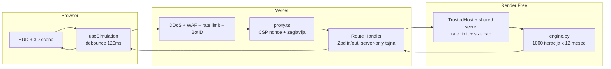

# PRD / SoW - Aura Workspace

**Proizvod:** Aura Workspace - Spatial Business Simulator
**Naručilac:** Fluxis Labs (Marko-Vuchko)
**Repozitorijum:** `Marko-Vuchko/fluxis-labs-aura-workspace` (javan)
**Verzija dokumenta:** 1.0
**Status:** Odobreno za implementaciju
**Osnov:** 131 odluka doneta kroz strukturisano ispitivanje, plus verifikacija stanja na disku i u zvaničnoj dokumentaciji.

---

## 1. Svrha i poslovni cilj

Aura Workspace je prostorni 3D komandni centar koji u realnom vremenu simulira poslovne scenarije SaaS kompanije. Korisnik pomera slajdere, a Python engine na svaku promenu izvršava Monte Carlo simulaciju od 1000 iteracija kroz 12 meseci i vraća prihod, profit, ocenu rizika, dvanaestomesečnu projekciju i nove koordinate za sedam svetlećih čvorova u 3D sceni.

Projekat je vodeći portfolio eksponat agencije Fluxis Labs. Njegov zadatak je da B2B klijentima i potencijalnim investitorima demonstrira spoj tri retko udružene veštine: netrivijalne matematičke simulacije u Pythonu, naprednog WebGL renderovanja i produkcijski ozbiljne bezbednosti.

**Merilo uspeha:** posetilac koji nikada nije čuo za Fluxis Labs razume šta alat radi u prvih trideset sekundi, može sam da izazove krizni scenario, i ne vidi nijednu grešku, nijedan beli ekran i nijedan lažan podatak.

---

## 2. Obim

### 2.1 Ulazi u obim

- Next.js 16 frontend sa 3D scenom, HUD-om, zvukom i dvojezičnim interfejsom
- Python FastAPI backend sa Monte Carlo engine-om
- Bezbednosni sloj na Vercel edge-u i u aplikaciji
- Case study stranica, README, OG kartica, guided tour
- CI provere, konfiguracija za deploy, dokumentacija

### 2.2 Ne ulazi u obim

- Autentifikacija, registracija i korisnički nalozi
- Bilo kakva baza podataka; sve je simulacija u memoriji
- Transakcioni email i eksterno skladištenje fajlova
- Plaćeni API servisi ili plaćene platforme; ceo sistem mora da radi za 0 dolara mesečno
- Klasični 2D grafikoni kao zamena za 3D scenu

---

## 3. Tehnološki stack

| Sloj | Tehnologija | Napomena |
| --- | --- | --- |
| Framework | Next.js 16.3.0, App Router | `middleware.ts` je zamenjen fajlom `proxy.ts` |
| Runtime | React 19.2.8, Node 24.12.0 | React zaključan na `<19.3` zbog R3F peer opsega |
| Stilizovanje | Tailwind v4 (CSS-first), shadcn/ui, Lucide | Bez `tailwind.config`, tema kroz `@theme` |
| 3D | three 0.185.1, @react-three/fiber 9.7.0, drei 10.7.8, @react-three/postprocessing 3.0.5 | Kompatibilnost proverena u npm registry-ju |
| Animacije | motion 13.0.0 | Framer Motion, aktuelno ime paketa |
| Validacija | Zod | Na ulazu i izlazu Route Handler-a |
| Backend | Python 3.11 na Renderu (3.13.14 lokalno), FastAPI, Uvicorn | Verzija zakovana kroz `runtime.txt` |
| Matematika | NumPy (simulacija), Pandas (agregacija i mesečna tabela) | |
| Hosting | Vercel (frontend), Render Free (backend) | 0 USD mesečno |

---

## 4. Arhitektura

Browser nikada ne razgovara sa Renderom direktno. Svaki poziv prolazi kroz Vercel, čime ga pokrivaju DDoS mitigacija, WAF, rate limit i BotID, a adresa backend-a ostaje tajna.



### 4.1 Tri nepregovaračka pravila

1. **Nijedan broj se ne računa na klijentu.** Frontend prikazuje isključivo ono što je Python izračunao. Kada veza pukne, scena zadržava poslednji Python rezultat vidljivo označen kao zastareo, ali nikada ne računa zamenu.
2. **Backend ne šalje rečenice, šalje kodove.** Odgovor nosi `insights: [{ code, severity, params }]`, a frontend renderuje lokalizovan tekst iz rečnika. EN i SR verzija prikazuju identične brojke.
3. **Sve prolazi kroz Vercel.** Adresa Rendera i deljena tajna žive samo u server-only varijablama, bez `NEXT_PUBLIC_` prefiksa.

---

## 5. Domenski model

SaaS pretplata u USD. Dvanaest meseci projekcije. Kumulativna baza klijenata koja kreće od nule. Vrednosti sa slajdera važe isto svakog meseca, pa simulacija odgovara na pitanje gde firma završava ako godinu dana radi na taj način. Tim se ne skalira automatski, čime preopterećenje ostaje stvaran rizik.

### 5.1 Konstante engine-a

Sve stoje imenovane na vrhu `backend/engine.py` radi podešavanja u jednom redu.

```python
ITERATIONS = 1_000
MONTHS = 12
FIXED_SEED = 20260810
BASE_CPL = 45.0              # USD po leadu
CPL_SIGMA = 0.35             # lognormalna disperzija
HALF_SATURATION = 15_000.0   # USD ad spenda gde prinos pada na pola
REFERENCE_PRICE = 149.0      # USD, cena pri kojoj je konverzija "normalna"
PRICE_ELASTICITY = 0.9
CONV_ALPHA, CONV_BETA = 2.0, 23.0   # beta raspodela, sredina ~8%
CLIENTS_PER_HEAD = 12
COST_PER_HEAD = 2_500.0      # USD mesecno
BASE_CHURN = 0.03
OVERLOAD_CHURN_FACTOR = 0.25
RISK_WEIGHTS = (0.40, 0.25, 0.20, 0.15)  # gubitak, preopterecenje, volatilnost, zavisnost od reklame
HEALTH_WARN, HEALTH_CRIT = 70.0, 40.0
```

Većina ovih vrednosti je eksplicitno izabrana. Tri nisu i predstavljaju inženjersku procenu koju je naručilac prepustio izvođaču: `FIXED_SEED`, `OVERLOAD_CHURN_FACTOR` i `CPL_SIGMA`. One se smeju menjati tokom kalibracije presetova bez novog odobrenja; sve ostale ne.

### 5.2 Jezgro simulacije

Jedan vektorizovan prolaz oblika `(ITERATIONS, MONTHS)`, bez Python petlje po iteracijama. Petlja po mesecima je dozvoljena samo za kumulativnu bazu klijenata.

```python
rng = np.random.default_rng(seed)
cpl = rng.lognormal(np.log(BASE_CPL), CPL_SIGMA, (ITERATIONS, MONTHS))
reach = ad_spend / (ad_spend + HALF_SATURATION)          # opadajuci prinos
leads = (ad_spend / cpl) * reach
conv = np.clip(rng.beta(CONV_ALPHA, CONV_BETA, (ITERATIONS, MONTHS))
               * (REFERENCE_PRICE / price) ** PRICE_ELASTICITY, 0.0, 1.0)
new_customers = leads * conv
capacity = team_size * CLIENTS_PER_HEAD
# po mesecu: base = base + new - churn*base, served = min(base, capacity)
# overload = max(0, base/capacity - 1); churn = BASE_CHURN + overload*OVERLOAD_CHURN_FACTOR
revenue = served * price
costs = ad_spend + opex + team_size * COST_PER_HEAD
profit = revenue - costs
cash = cash_reserve + cumsum(profit)
```

### 5.3 Risk Score

Računa se **po mesecu**, jer ceo ekran prati scrubber. Vrednost je 0 do 100, razložena na četiri komponente koje se prikazuju kao mini barovi:

| Komponenta | Definicija | Ponder |
| --- | --- | --- |
| Verovatnoća gubitka | udeo iteracija sa `profit < 0` | 0.40 |
| Preopterećenje tima | prosečan `overload` | 0.25 |
| Volatilnost profita | koeficijent varijacije `std/abs(mean)` | 0.20 |
| Zavisnost od reklame | `ad_spend / ukupni troškovi` | 0.15 |

### 5.4 Osetljivost

Dobija se korelacijom blago ušumljenih ulaza sa profitom **unutar istog prolaza**, bez ijedne dodatne simulacije. Daje pouzdano rangiranje poluga i procenu snage preko standardizovanog regresionog koeficijenta, ali ne optimum. Tekstovi preporuka zato tvrde smer i snagu poluge, nikada tačan procenat.

### 5.5 Sedam čvorova

Fiksan redosled **u nizu odgovora**: `["marketing", "sales", "support", "operations", "profit", "churn", "cash_runway"]`.

Šest čvorova stoji u prstenu, dok je **Profit izdignut iznad ravni u centru** kao ishod svega. Radijus od centra nosi zdravlje metrike, ugao je fiksan po ulozi, pa je pomeranje grafa bukvalno rezultat simulacije.

**Ugaoni redosled u prstenu se razlikuje od redosleda u nizu i nije proizvoljan.** U smeru kazaljke, počev od ugla 0, ide:

| Pozicija | Čvor | Ugao |
| --- | --- | --- |
| 1 | Marketing | 0 stepeni |
| 2 | Sales | 60 |
| 3 | Support | 120 |
| 4 | Churn | 180 |
| 5 | Operations | 240 |
| 6 | Cash Runway | 300 |
| centar | Profit | izdignut po osi Y iznad ravni prstena |

Ovaj raspored postoji zato da bi se lanac vrednosti čitao kao priča dok se scena okreće. Serijalizacija u niz ostaje po redosledu iz prvog pasusa, pa se ugao mora izvesti iz imena čvora, nikada iz indeksa u nizu.

Zdravlje iznad 70 je zeleno `#34D399`, 40 do 70 narandžasto `#FBBF24`, ispod 40 crveno `#FB7185`. Cash Runway kada je firma profitabilna prikazuje `PROFITABLE` umesto izmišljenog broja (`runway_months: null`).

**Devet semantičkih niti** umesto potpunog grafa od 21:

```
marketing -> sales
sales -> support
sales -> operations
support -> churn
support -> operations
operations -> profit
churn -> profit
profit -> cash_runway
cash_runway -> marketing   (budzetska povratna sprega)
```

---

## 6. Ugovor podataka

Ovo je jedini izvor istine za sve slojeve. Svaka izmena mora biti sinhrona u Pydantic modelu, TypeScript ogledalu i Zod šemi.

### 6.1 Opsezi ulaza

| Parametar | Tip | Min | Max | Podrazumevano |
| --- | --- | --- | --- | --- |
| `ad_spend` | float | 0 | 50 000 | 8 000 |
| `price` | float | 10 | 2 000 | 149 |
| `team_size` | int | 1 | 50 | 6 |
| `opex` | float | 0 | 100 000 | 12 000 |
| `cash_reserve` | float | 0 | 500 000 | 120 000 |
| `seed` | int? | - | - | `FIXED_SEED` |

Podrazumevane vrednosti su režirane tako da daju zdrav scenario sa jednim narandžastim čvorom, dakle nešto što se odmah može popraviti pred klijentom.

Parametar `seed` je opcion i postoji isključivo zbog `RESEED` funkcije iz FR-2. Kada ga klijent ne pošalje, engine koristi `FIXED_SEED`, pa isti ulaz uvek daje isti rezultat i demo je ponovljiv pred klijentom.

### 6.2 `POST /api/simulate` - odgovor

```jsonc
{
  "meta": {
    "engine_version": "1.1.0",
    "iterations": 1000,
    "months": 12,
    "seed": 20260810,
    "compute_ms": 41.7,
    "currency": "USD",
    "clients_per_head": 12,
    "cost_per_head": 2500.0
  },
  "annual": {
    "revenue":     [p10, p50, p90],
    "profit":      [p10, p50, p90],
    "margin":      [p10, p50, p90],   // udeo 0..1
    "ending_cash": [p10, p50, p90]
  },
  "months": [
    {
      "index": 1,                      // 1..12
      "revenue": [p10, p50, p90],
      "profit":  [p10, p50, p90],
      "margin": 0.18,
      "customers": 42.5,
      "churn_rate": 0.031,
      "capacity_used": 0.59,           // >1 znaci preopterecenje
      "cash": 131204.5,
      "runway_months": null,           // null = PROFITABLE
      "risk": { "score": 34.2, "components": [0.12, 0.00, 0.41, 0.28] },
      "nodes": [[health, x, y, z], ...],  // tacno 7, redosled iz 5.5
      "insights": [                        // tacno 3; prate ovaj mesec
        { "code": "CAP_UNDERUSED", "severity": "info", "params": { "capacity_used": 0.12 } }
      ]
    }
  ],
  "histogram": {
    "metric": "annual_profit",
    "bin_edges": [ /* 31 broj */ ],
    "counts":    [ /* 30 celih brojeva */ ]
  },
  "sensitivity": [
    { "param": "price", "coefficient": -0.62, "rank": 1 }
  ],
  "insights": [
    { "code": "CAP_BREACH", "severity": "critical", "params": { "overload_pct": 34.0, "month": 7 } }
  ]
}
```

Svi brojevi sa pokretnim zarezom se zaokružuju na dve decimale pre serijalizacije. Uključen je `GZipMiddleware`. `insights` sadrži tačno tri stavke, sortirane po ozbiljnosti. Uvidi žive i na svakom mesecu (`months[i].insights`); top-level `insights` je alias meseca 12.

### 6.3 `GET /health` - odgovor

```json
{ "status": "ok", "engine_version": "1.1.0", "uptime_s": 1234.5, "numpy_warmup_ms": 18.3 }
```

Boot Screen ispisuje ove vrednosti kao stvarnu telemetriju, ne kao naraciju.

### 6.4 Katalog insight kodova

Ozbiljnost je `info`, `warning` ili `critical`. Svaki kod ima EN i SR tekst u rečniku, sa istim `params` popunjenim brojkama iz Pythona.

| Kategorija | Kodovi |
| --- | --- |
| Kapacitet | `CAP_BREACH`, `CAP_NEAR_LIMIT`, `CAP_UNDERUSED`, `CAP_HIRE_SUGGESTED`, `CAP_CHURN_FROM_OVERLOAD` |
| Cena | `PRICE_ABOVE_REFERENCE`, `PRICE_BELOW_REFERENCE`, `PRICE_CONVERSION_DROP`, `PRICE_MARGIN_THIN`, `PRICE_STRONGEST_LEVER` |
| Marketing | `MKT_SATURATION`, `MKT_EFFICIENT`, `MKT_DEPENDENCY_HIGH`, `MKT_UNDERSPEND`, `MKT_CAC_ABOVE_LTV` |
| Likvidnost | `CASH_RUNWAY_CRITICAL`, `CASH_RUNWAY_WARNING`, `CASH_PROFITABLE`, `CASH_BURN_RISING`, `CASH_LOSS_PROBABILITY` |
| Preporuke | `REC_TOP_LEVER`, `REC_SECOND_LEVER` |

---

## 7. Funkcionalni zahtevi

### FR-1 Boot Screen i cold start

Naslov glasi `Booting Aura Engine & Synchronizing Python Neural Nodes...`. Ispod njega se ispisuju **stvarni događaji**: redni broj pokušaja konekcije, izmereno vreme odgovora u milisekundama, verzija engine-a i vreme zagrevanja NumPy-ja. Traka napretka prati stvarni tok, ne tajmer.

Wake ping kreće čim se stranica učita. Poll traje do 90 sekundi, pa se nudi Retry. Prva simulacija se šalje još tokom boot-a, tako da je scena puna u trenutku ulaska. Ekran se završava dugmetom `ENTER AURA` koje otključava `AudioContext` i pokreće nalet kamere.

### FR-2 Control Deck

Pet slajdera iz tabele 6.1, svaki sa živom brojkom i poljem za precizan unos. Svaka promena okida sintetički zvučni signal i debounce-ovan zahtev. Ispod njih stoje četiri preseta: `Bootstrap`, `Growth Push`, `Overload Crisis`, `Optimized`. Preset animirano prevlači slajdere kroz 600 ms, ali šalje **samo jedan** zahtev na kraju animacije.

Deck takođe **transparentno ispisuje dve konstante koje korisnik ne kontroliše, a koje bitno menjaju rezultat**: kapacitet od 12 klijenata po čoveku i trošak od 2500 USD po glavi mesečno. Bez toga slajder za veličinu tima deluje kao da nema cenu, a preopterećenje kao da je proizvoljno.

### FR-2b RESEED

Monte Carlo je podrazumevano determinističan, jer se demo pred klijentom mora ponoviti isto. Zbog toga postoji **diskretno `RESEED` dugme**, namerno nenametljivo i van glavnog toka pažnje, koje generiše nov seed i šalje ga u zahtevu.

Njegova svrha je da pokaže da je reč o stvarnoj stohastičkoj simulaciji, a ne o unapred izračunatoj tabeli: isti slajderi sa drugim seed-om daju blago drugačiji ishod unutar istog p10/p90 opsega. Trenutni seed se ispisuje pored dugmeta u `Geist Mono` fontu, a povratak na `FIXED_SEED` mora biti moguć jednim klikom, tako da se demo uvek vraća u poznato stanje.

### FR-3 Spatial 3D Canvas

Sedam ikosaedarskih čvorova sa žičanim ramom, svetlećim jezgrom i halo sprite-om. Puls ubrzava sa rizikom. Devet niti sa česticama koje putuju duž krive, sve u jednom instanciranom mesh-u. Perspektivna mreža na podu koja bledi u daljinu, magla i retke zvezde. Bloom sa pragom 0.85 i intenzitetom 1.2.

Kamera: ograničeni `OrbitControls` sa spora auto-rotacijom koja prestaje čim korisnik uhvati miša. Početni kadar je pod uglom od 20 stepeni.

Hover daje HUD tooltip. Klik zaključava čvor i otvara HTML karticu zakačenu za čvor u 3D prostoru preko drei `Html`. Kartica ostaje otvorena tokom premotavanja i njene brojke se menjaju sa mesecom.

### FR-4 Sloj podataka u sceni

Histogram godišnjeg profita kao 30 svetlećih stubova na podu scene, sa refleksijom. Dvanaestomesečna projekcija kao svetleća kriva sa scrubber-om ispod nje.

### FR-5 Scrubber i vremenska koherentnost

Scrubber startuje na mesecu 12. **Ceo ekran prati scrubber**: KPI brojke, Risk Score, Copilot, graf čvorova i kartica detalja govore o izabranom mesecu. Histogram je jedini izuzetak i uvek prikazuje raspodelu ukupnog godišnjeg profita, pa se eksplicitno označava kao godišnji.

### FR-6 AI Strategic Copilot

Panel na dnu prikazuje tri najozbiljnija uvida, sa stagger animacijom pri svakoj novoj simulaciji, bez istorije. Ton je precizan poslovni analitičar u punim rečenicama sa konkretnim brojkama. Preporuke iz matrice osetljivosti tvrde smer i snagu poluge, nikada tačan procenat.

### FR-7 Dvojezičnost

Engleski je podrazumevan, srpski se bira ručno i pamti u `localStorage`. Prevodi se sve što korisnik vidi, uključujući boot poruke, svih 22 insight teksta, guided tour i `/about`. Format brojeva ostaje engleski u oba jezika: **kompaktan prikaz** (`284.3k`) sa **punom vrednošću na hover** (`284,312 USD`); p10 i p90 idu u isti tooltip, ispod pune vrednosti, a ne stoje trajno pored brojke. Interpolacija ide isključivo kao tekst, nikada kao HTML.

### FR-8 Zvuk

Sintetički tonovi preko Web Audio API-ja, bez ijednog audio fajla. Pentatonska lestvica tako da nijedna kombinacija ne zvuči disonantno, visina prati vrednost slajdera, kratki sinusni blipovi sa mekim envelope-om. Poseban ton kada čvor pređe u upozorenje ili kritično stanje. Boot sekvenca sa narastajućim tonom i `power up` udarcem na `ENTER AURA`. Ikonica zvučnika u HUD-u pamti izbor.

### FR-9 Stanje greške

Neblokirajući `LINK LOST` bedž u HUD-u, poruka u Copilot panelu i automatski retry sa backoff-om. Scena zadržava poslednje važeće stanje, vidljivo označeno kao zastarelo. Tokom računanja se vidi tanka linija napretka i `COMPUTING` bedž, dok scena ostaje potpuno interaktivna.

### FR-9b Telemetrija računanja

Pored statusnog bedža stalno stoji **bedž sa vrednošću `compute_ms` iz poslednjeg odgovora**, u `Geist Mono` fontu, uz broj iteracija i broj meseci iz `meta` bloka.

Ovo nije ukras nego dokaz. Broj iteracija je namerno fiksiran na 1000 i nije izložen korisniku, pa je izmereno vreme računanja jedini vidljiv znak da Python zaista radi posao na svaki pomeraj slajdera. Vrednost dolazi iz odgovora i nikada se ne meri na klijentu.

### FR-10 Otpornost prikaza

Detekcija WebGL-a pre montiranja scene i elegantan zamenski 2D panel koji zadržava sve brojke iz Pythona, plus oporavak na `onContextLost`. Granularni Error Boundary oko scene i oko svakog panela. Poštovanje `prefers-reduced-motion` gasi auto-rotaciju, čestice i pulsiranje, ali zadržava zvuk i 3D prikaz.

3D scena je pointer-first (orbit, hover, klik za zaključavanje čvora). To je prihvatljivo jer su sve brojke dostupne preko HUD-a (Control Deck, KPI/Risk, Copilot, scrubber), a kada WebGL nije dostupan SceneFallback je potpuno tastaturno dostupan. Otvorena node detail kartica ima focus trap i Escape.

### FR-11 Guided tour

Četiri koraka (scena, Control Deck, Copilot, presetovi) sa isticanjem elementa. Pokreće se tek posle `ENTER AURA` i posle što je prva simulacija već popunila scenu. Preskočiv, pamti se u `localStorage`.

### FR-12 Portfolio sloj

`/about` kao statična case study stranica bez 3D-a: arhitektonski dijagram, objašnjenje Monte Carlo modela, lista izazova, link ka `github.com/Marko-Vuchko` i placeholder konstanta za Fluxis Labs URL. README sa mermaid dijagramom. OG slika generisana kodom kroz `opengraph-image.tsx`. Potpis `Built by Fluxis Labs`.

### FR-13 Responzivni raspored

Desktop je primarni cilj, ali link se deli na LinkedIn-u i otvara se sa telefona, pa mobilni prikaz mora biti upotrebljiv, ne samo prisutan.

Ispod praga od 1024 px raspored se preslaguje: **3D scena zauzima gornju polovinu ekrana**, a **Control Deck postaje donji drawer** koji se povlači nagore i pokriva scenu samo dok se koristi. KPI i Risk se sažimaju u jednu horizontalnu traku, Copilot prikazuje jedan uvid sa mogućnošću listanja kroz preostala dva, a scrubber ostaje trajno vidljiv jer nosi vremensku koherentnost celog ekrana.

Nijedna funkcija se ne uklanja i nijedna brojka se ne skriva; menja se isključivo raspored. Kvalitet scene na mobilnom preuzima ista troslojna auto-degradacija iz 8.2, bez posebne mobilne grane koda.

---

## 8. Nefunkcionalni zahtevi

### 8.1 Bezbednost

| Sloj | Mera |
| --- | --- |
| Vercel platforma | Automatska DDoS mitigacija L3/L4/L7 (besplatna, bez konfiguracije, blokiran saobraćaj se ne naplaćuje) |
| Vercel WAF | Rate limit na `/api` po IP-u, blokada exploit sondi (`/wp-admin`, `/.env`, `/.git/config`, `/phpmyadmin`), odbijanje nekorišćenih metoda, managed rulesets. Postupni rollout: `log`, pregled saobraćaja, `deny` u preview-u, pa produkcija. Publish pokreće vlasnik naloga, nikada agent |
| Botovi | Vercel BotID na `basic` nivou nad `/api/simulate`, plus provera `Origin` i `Sec-Fetch-Site` |
| Zaglavlja (`proxy.ts`) | CSP sa nonce i `strict-dynamic` (`unsafe-eval` samo u dev-u), HSTS preload, `nosniff`, `X-Frame-Options: DENY` uz `frame-ancestors 'none'`, `Referrer-Policy`, `Permissions-Policy`, COOP, CORP, `upgrade-insecure-requests`, `poweredByHeader: false` |
| Route Handler | Zod validacija ulaza i izlaza, server-only `AURA_API_URL` i `AURA_API_SECRET`, timeout, cap na veličinu tela, generičke poruke greške |
| FastAPI | Pydantic `extra="forbid"` i 422, odbijanje `NaN` i beskonačnih vrednosti, provera deljene tajne, `TrustedHostMiddleware`, rate limit 60/min po IP, globalno ograničenje konkurentnosti, limit veličine tela, globalni exception handler bez stack trace-a, ugašeni `/docs`, `/redoc` i `/openapi.json` u produkciji, logovanje sa heširanim IP-om |
| Lanac snabdevanja | Tačni pinovi, commit-ovan lockfile, `npm ci`, `npm audit`, `pip-audit`, Dependabot, GitHub secret scanning, akcije zakovane na SHA, zaštita `main` grane, `SECURITY.md` |
| Klijent | Nigde `dangerouslySetInnerHTML`, nikakav `eval`, `rel="noopener noreferrer"`, Zod provera odgovora pre nego što dotakne stanje |

Broj Monte Carlo iteracija je fiksan, pa napadač ne može da naruči skuplji posao.

### 8.2 Performanse

- Ciljnih 60 FPS na modernom laptopu; troslojna auto-degradacija preko drei `PerformanceMonitor` snižava prvo `dpr`, pa broj čestica, pa tek na kraju bloom
- Debounce od 120 ms tokom prevlačenja plus obavezan finalni zahtev na otpuštanje
- Odgovor se kompaktno kodira, zaokružuje na dve decimale i GZip-uje

### 8.3 Pristupačnost

`prefers-reduced-motion`, fokus prstenovi, tastaturna kontrola svih slajdera, aria labele. Focus trap i restore fokusa na guided tour, mobile Control Deck drawer i node detail kartici. Live region (`role="status"`) za COMPUTING / LINK LOST / STALE. Risk barovi sa `role="progressbar"` i tekstualnim `aria-valuetext` vrednostima. Skip link ka `#aura-controls` i landmark regioni (scena, control deck, metrike, kopilot).

3D scena nije keyboard-first. Prihvatljivo uz jasan fallback: HUD izlaže iste brojke tastaturom, a WebGL nedostupnost vodi na 2D SceneFallback. Dokumentovano u FR-10.

### 8.4 Kvalitet koda

TypeScript `strict` bez ijednog `any`. Ruff i pune type hint anotacije na Pythonu. Nula grešaka na `tsc --noEmit`, `eslint`, `next build`, Ruff i pytest.

---

## 9. Struktura repozitorijuma

Next ostaje u rootu; organizacija frontend koda je po funkciji, ne po tipu fajla.

```
fluxis-labs-aura-workspace/
├── app/
│   ├── layout.tsx, page.tsx, globals.css, opengraph-image.tsx
│   ├── about/page.tsx
│   └── api/
│       ├── simulate/route.ts
│       └── health/route.ts
├── proxy.ts                      # CSP + security headers (Next 16)
├── features/
│   ├── simulation/               # types, api-client, use-simulation, defaults, presets
│   ├── scene/                    # spatial-canvas, node-mesh, link-flow, particle-field,
│   │                             # histogram-bars, projection-curve, scene-background, quality-manager
│   ├── hud/                      # control-deck, kpi-panel, risk-gauge, month-scrubber,
│   │                             # preset-bar, reseed-control, status-badge, compute-badge,
│   │                             # language-switch, sound-toggle, node-detail-card, mobile-deck-drawer
│   ├── copilot/
│   ├── boot/
│   └── tour/
├── components/ui/                # shadcn
├── lib/
│   ├── i18n/                     # dictionary, language-provider, format
│   └── audio/soundscape.ts
├── backend/
│   ├── engine.py, main.py, schemas.py
│   ├── requirements.txt, requirements-dev.txt, runtime.txt, Readme.md
│   └── tests/
├── docs/                         # PRD.md, PHASES.md
├── .github/                      # workflows, dependabot.yml
├── render.yaml, .env.example, SECURITY.md, README.md
```

---

## 10. Vizuelni identitet

| Element | Vrednost |
| --- | --- |
| Paleta | Deep Space Cyan: podloga `#05070D`, primarna `#22D3EE`, akcent `#A855F7` |
| Statusi | stabilno `#34D399`, upozorenje `#FBBF24`, kritično `#FB7185` |
| Tipografija | Geist Sans za tekst, Geist Mono za sve brojke i telemetriju |
| HUD | Tanki ugaoni brekteti, poluprovidna tamna podloga sa blur-om, jedna svetleća ivica |
| Raspored | 3D scena preko celog ekrana kao podloga; Control Deck levo, KPI i Risk gore desno, Copilot dole, scrubber dole na sredini |
| Mobilni | Control Deck postaje donji drawer, scena zauzima gornju polovinu |
| shadcn | `npx shadcn@latest init --preset b27GcrRo --template next --pointer`, pa se Inter i neutral tema prepisuju gornjom paletom i Geist fontovima |

---

## 11. Kriterijumi prihvatanja

Posao je završen kada su sve stavke ispunjene:

1. `ruff check`, `pytest`, `tsc --noEmit`, `eslint` i `next build` prolaze bez ijedne greške
2. Pytest dokazuje determinizam sa fiksnim seed-om, `0 <= risk <= 100`, opsege margina, odbijanje nepoznatih polja i `NaN`, saglasnost OpenAPI šeme sa TypeScript ogledalom, i da sva četiri preseta pogađaju svoja ciljna stanja
3. Ručni prolaz celog toka u browseru: boot, `ENTER AURA`, svih pet slajdera, sva četiri preseta, `RESEED`, scrubber, klik na čvor, promena jezika i namerni prekid backend-a
4. Security zaglavlja stvarno stižu u odgovoru, provereno u Network tabu
5. Nijedna brojka u UI-ju ne potiče iz klijentskog računa
6. Mobilni raspored iz FR-13 proveren na širini od 390 px, bez horizontalnog skrolovanja i bez skrivenih funkcija
7. Screenshot-ovi priloženi kao dokaz, uključujući i mobilni prikaz

---

## 12. Rizici

| Rizik | Ublažavanje |
| --- | --- |
| Proxy troši Vercel funkcije; debounce od 120 ms može napraviti stotine poziva u minuti po korisniku | Prvo keširanje identičnih kombinacija parametara, pa podizanje debounce-a; smanjenje vernosti podataka je poslednja opcija |
| CSP nonce gasi statičko keširanje, sve postaje dinamičko | Prihvaćeno svesno; aplikacija je jedan interaktivni ekran |
| Render Free cold start do 60 s | Boot Screen sa stvarnom telemetrijom i wake ping pri učitavanju |
| Veličina odgovora (84 stanja čvorova) | Kompaktno kodiranje, zaokruživanje, GZip |
| WAF pravila mogu blokirati prave korisnike | Postupni rollout, publish pokreće vlasnik |
| React zaključan na `<19.3` | Verzija se ne dira |
| Gustina scene obara FPS | Troslojna auto-degradacija je obavezna, ne opciona |
| shadcn na Next 16 nije verifikovan | Komanda je bezbedna bez `--name`; ako pukne, komponente se dodaju ručno iz izvora |

---

## 13. Način rada i isporuka

- Radi se **faza po fazu**, po uputstvima naručioca. Podela je u [docs/PHASES.md](PHASES.md)
- Ako se usred rada ispostavi da je neka odluka tehnički skuplja nego što izgleda, izvođač se zaustavlja sa dokazima i alternativama umesto da improvizuje
- Commit poruke su Conventional Commits na engleskom i objašnjavaju zašto, ne šta
- Lokalno pokretanje je jedna komanda `npm run dev:all` preko `concurrently`
- Deploy se ne pokreće bez izričite reči naručioca. Render servis kreira vlasnik naloga
- URL Fluxis Labs-a stoji kao placeholder konstanta na jednom mestu

### 13.1 Git i vidljivost

Zatečeno stanje: lokalni repozitorijum ima **jedan commit i nijedan remote**, dok je `Marko-Vuchko/fluxis-labs-aura-workspace` javan i **potpuno prazan**.

Remote se povezuje u fazi 03, prvi push ide odmah posle nje, a zatim posle svake završene faze. To znači da će repozitorijum biti javno vidljiv i u nedovršenim stanjima, kroz celu izgradnju. Ako to nije prihvatljivo, vlasnik naloga prebacuje repozitorijum u privatan **pre prvog push-a**; posle toga je istorija već objavljena.

Nijedan agent ne menja vidljivost repozitorijuma, ne radi force push i ne dira zaštitu `main` grane.
